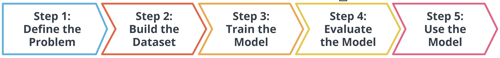
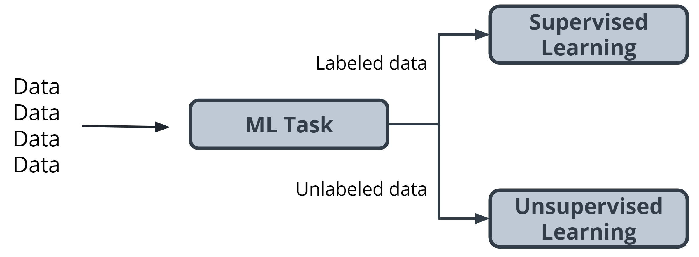
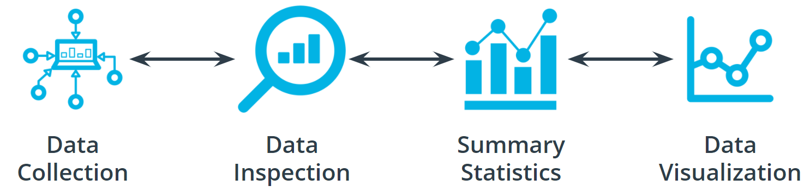

## 2.1 Introduction to the 5 ML Steps

* **Clustering** is an unsupervised learning task that helps to determine if there are any naturally occurring groupings in the data.
* A **categorical label** has a discrete set of possible values, such as "is a cat" and "is not a cat."
* A **continuous (regression) label** does not have a discrete set of possible values, which means there are potentially an unlimited number of possibilities.
* **Discrete** is a term taken from statistics referring to an outcome that takes only a finite number of values (such as days of the week).
* A **label** refers to data that already contains the solution.
* Using **unlabeled data** means you don't need to provide the model with any kind of label or solution while the model is being trained.

## 2.2 Define the Problem

Initially, we divided tasks based on the presence or absence of labeled data while training our model. Often, tasks are further defined by the type of label that is present.

In  **supervised learning** , there are two main identifiers that you will see in machine learning:

* A **categorical** label has a discrete set of possible values. In a machine learning problem in which you want to identify the type of flower based on a picture, you would train your model using images that have been labeled with the categories of the flower that you want to identify. Furthermore, when you work with categorical labels, you often carry out classification tasks, which are part of the supervised learning family.
* A **continuous** (regression) label does not have a discrete set of possible values, which often means you are working with numerical data. In the snow cone sales example, we are trying to predict the number of snow cones sold. Here, our label is a number that could, in theory, be any value.

## 2.3 Build the Dataset

To build a good dataset, there are four key aspects to be considered when working with your data. First, you need to collect the data. Second, you should inspect your data to check for outliers, missing or incomplete values, and to see if any kind of data reformatting is required. Third, you should use summary statistics to understand the scope, scale, and shape of the dataset. Finally, you should use data visualizations to check for outliers, and to see trends in your data.

* **Impute** is a common term referring to different statistical tools that can be used to calculate missing values from your dataset.
* **Outliers** are data points that are significantly different from other date in the same sample.

  

## 2.4 Model Training

* **Hyperparameters** are settings on the model that are not changed during training but can affect how quickly or how reliably the model trains, such as the number of clusters the model should identify.
* A **loss function** is used to codify the model’s distance from this goal.
* **Training dataset** : The data on which the model will be trained. Most of your data will be here.
* **Test dataset** : The data withheld from the model during training, which is used to test how well your model will generalize to new data.
* **Model parameters** are settings or configurations the training algorithm can update to change how the model behaves.

### Additional Info

**Linear models**

One of the most common models covered in introductory coursework, linear models simply describe the relationship between a set of input numbers and a set of output numbers through a linear function (think of *y = mx + b* or a line on a  *x vs y chart* ). Classification tasks often use a strongly related logistic model, which adds an additional transformation mapping the output of the linear function to the range [0, 1], interpreted as “probability of being in the target class.” Linear models are fast to train and give you a great baseline against which to compare more complex models. A lot of media buzz is given to more complex models, but for most new problems, consider starting with a simple model.

**Tree-based models**

Tree-based models are probably the second most common model type covered in introductory coursework. They learn to categorize or regress by building an extremely large structure of nested *if/else* blocks, splitting the world into different regions at each *if/else* block. Training determines exactly where these splits happen and what value is assigned at each leaf region. For example, if you’re trying to determine if a light sensor is in sunlight or shadow, you might train tree of depth 1 with the final learned configuration being something like  *if (sensor_value > 0.698)* ,  *then return 1; else return 0;* . The tree-based model XGBoost is commonly used as an off-the-shelf implementation for this kind of model and includes enhancements beyond what is discussed here. Try tree-based models to quickly get a baseline before moving on to more complex models.

**Deep learning models**

Extremely popular and powerful, deep learning is a modern approach that is based around a conceptual model of how the human brain functions. The model (also called a neural network) is composed of collections of neurons (very simple computational units) connected together by weights (mathematical representations of how much information thst is allowed to flow from one neuron to the next). The process of training involves finding values for each weight. Various neural network structures have been determined for modeling different kinds of problems or processing different kinds of data.

A short (but not complete!) list of noteworthy examples includes:

* **FFNN** : The most straightforward way of structuring a neural network, the Feed Forward Neural Network (FFNN) structures neurons in a series of layers, with each neuron in a layer containing *weights* to all neurons in the previous layer.
* **CNN** : Convolutional Neural Networks (CNN) represent nested filters over grid-organized data. They are by far the most commonly used type of model when processing images.
* **RNN/LSTM** : Recurrent Neural Networks (RNN) and the related Long Short-Term Memory (LSTM) model types are structured to effectively represent for loops in traditional computing, collecting state while iterating over some object. They can be used for processing sequences of data.
* **Transformer** : A more modern replacement for RNN/LSTMs, the transformer architecture enables training over larger datasets involving sequences of data.

**Machine learning using Python libraries**

* For more classical models (linear, tree-based) as well as a set of common ML-related tools, take a look at  *scikit-learn* . The web documentation for this library is also organized for those getting familiar with space and can be a great place to get familiar with some extremely useful tools and techniques.
* For deep learning,  *mxnet* ,  *tensorflow* , and *pytorch* are the three most common libraries. For the purposes of the majority of machine learning needs, each of these is feature-paired and equivalent.

## 2.5 Model Evaluation

*Accuracy* is the fraction of predictions a model gets right.

Using Log Loss -

Let's say you're trying to predict how likely a customer is to buy either a jacket or t-shirt.

Log loss could be used to understand your model's uncertainty about a given prediction. In a single instance, your model could predict with 5% certainty that a customer is going to buy a t-shirt. In another instance, your model could predict with 80% certainty that a customer is going to buy a t-shirt. Log loss enables you to measure how strongly the model believes that its prediction is accurate.

In both cases, the model predicts that a customer will buy a t-shirt, but the model's certainty about that prediction can change.

## 2.6 Model Inference

Once you have trained your model, have evaluated its effectiveness, and are satisfied with the results, you're ready to generate predictions on real-world problems using unseen data in the field. In machine learning, this process is often called  **inference** .
